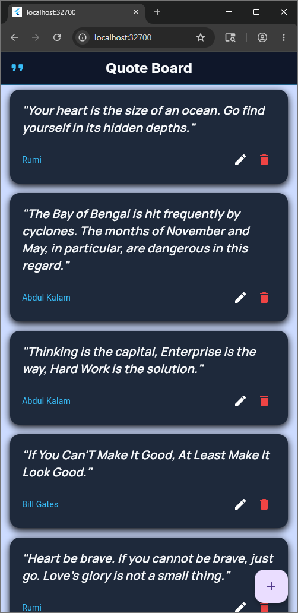
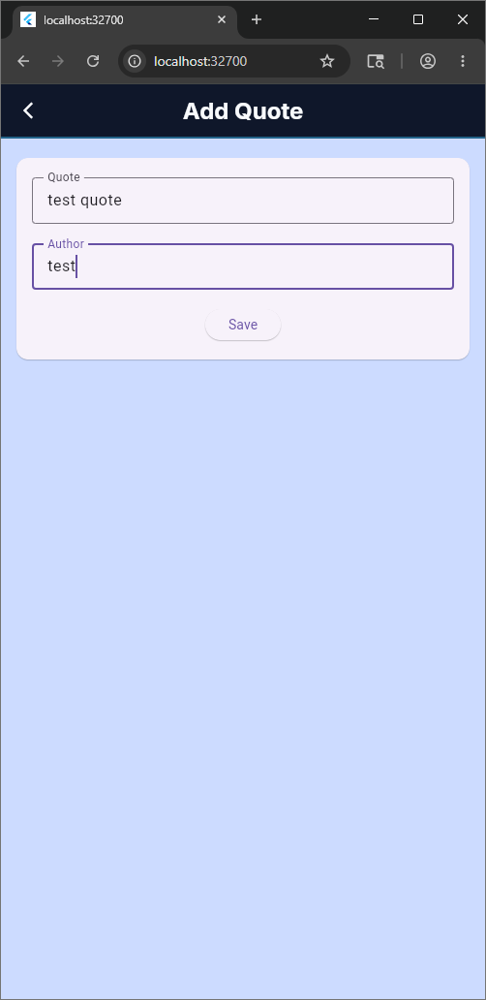
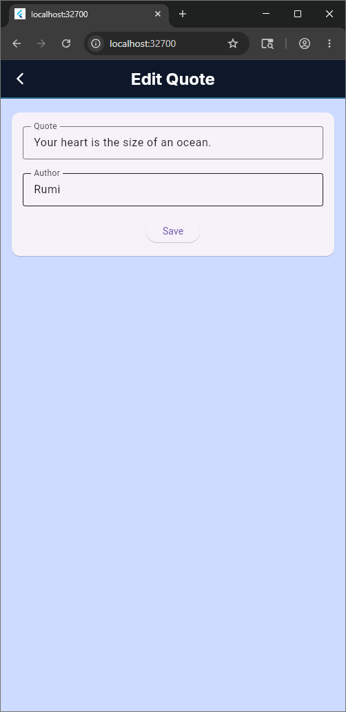
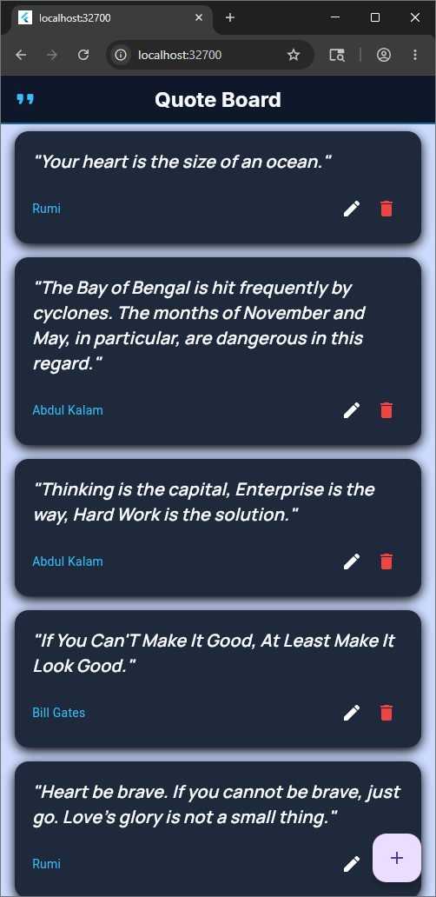
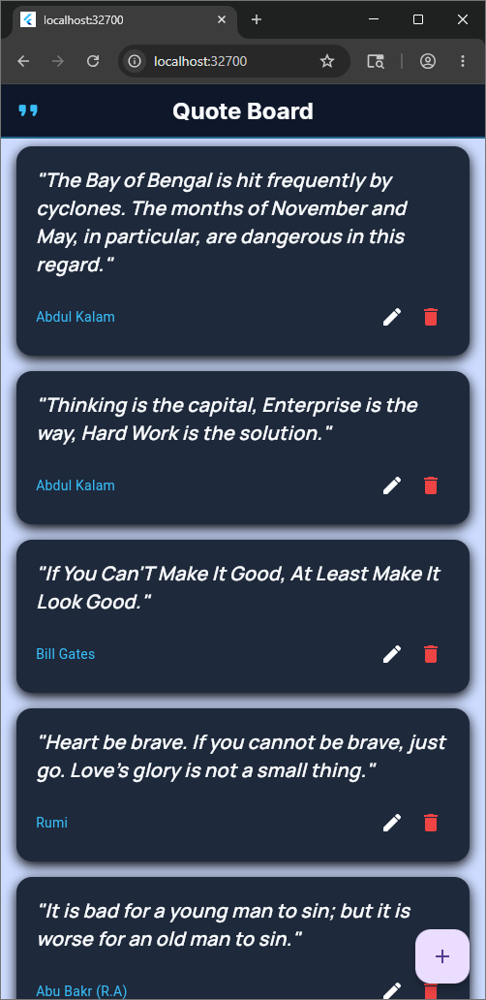
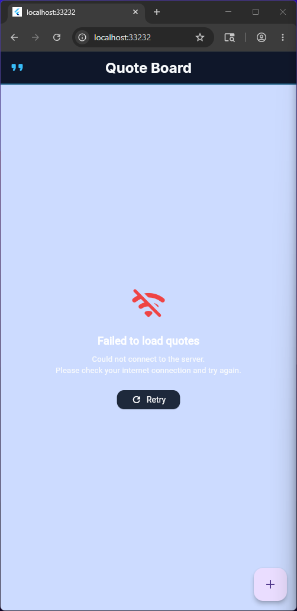

# Quote Board App using BLoC + Dio

A Flutter application for viewing, adding, editing, and deleting quotes. 
with clean architecture and separation of concerns.

## Dependencies

- **flutter_bloc**: Provides components that make it easy to implement the BLoC (Business Logic Component) design pattern.  
    flutter pub add flutter_bloc
- **equatable**: Simplifies object comparison, used heavily within Bloc states and events.
    flutter pub add equatable
- **dio**: A powerful Http client for Dart, used for networking in the service layer.
    flutter pub add dio
- **google_fonts**: Allows for using custom typography and styling.
    flutter pub add google_fonts

- **cupertino_icons**: Provides access to iOS-style default icons.
    flutter pub add cupertino_icons

## App Screenshots

### Home Screen

### Add Quote Screen

### Edit Quote Screen

### Delete Quote Screen

### Error Screen
